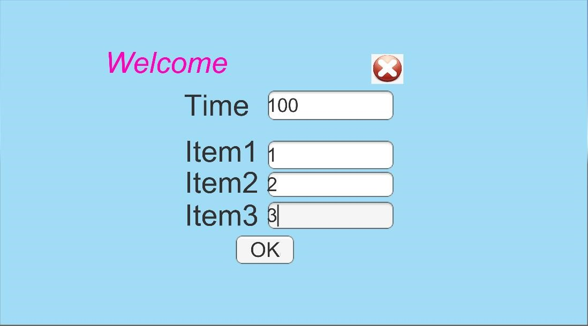
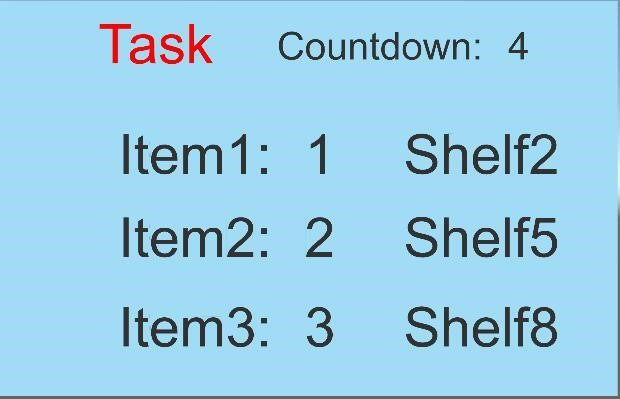
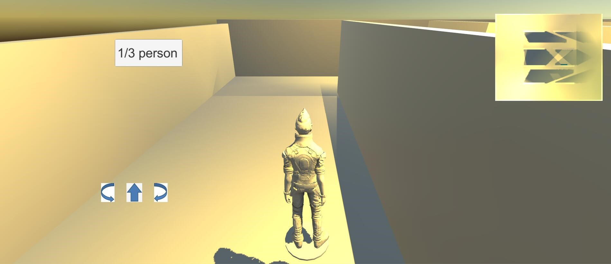
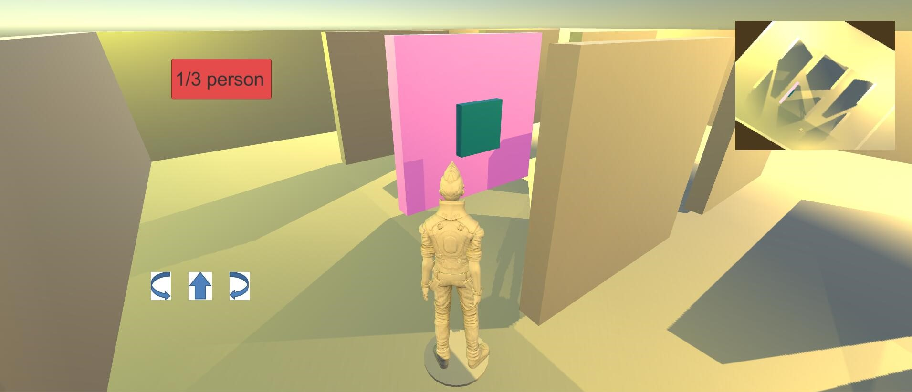
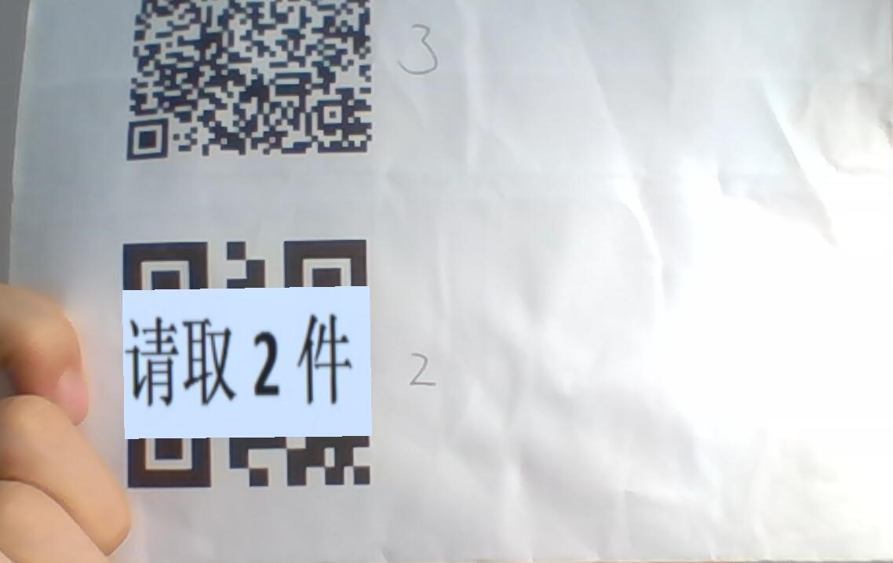
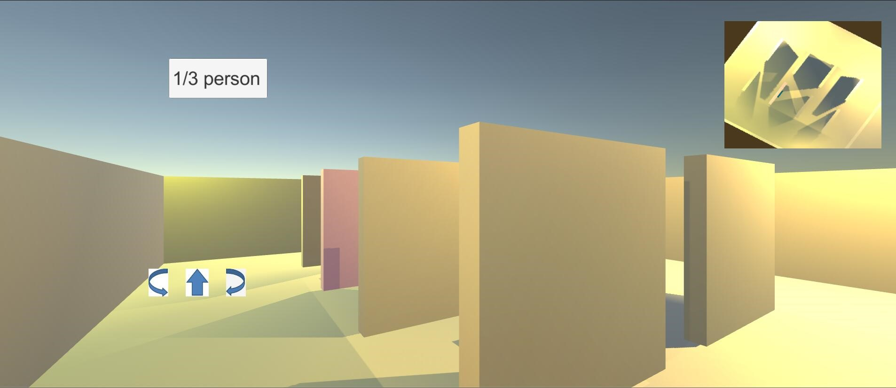

# PickingSystem

Files smaller than 10mb are uploaded. 

## overall
This program simulates the entire process of picking operations. First, enter the order scene. The user inputs order information. After the confirmation scene, enter the virtual warehouse scene. Based on the prompts, the user controls the operator to reach the designated shelf. Then enter the recognition scene, the user scans the QR code representing a specific item to complete the picking. After repeating the operation, according to the completion time, a success or failure result prompt is displayed. After completing a picking cycle, the program is initialized and enters the next loop.

## ordering scene
In this scene, the user inputs the task time and the number of pieces required for each item. The background program will give different prompts in the recognition scene based on the different number of pieces.

## confirming scene
This scene confirms the previously entered order and provides the user with a certain preparation time.

## picking scene
This scene simulates the arrangement of the warehouse. In the 3D scene, the user needs to control the picker and reach the designated shelf. The target shelf will be highlighted.

## recognizing scene
In this scene, the user needs to recognize a specific QR code through the camera. After successful recognition, the background program will overlay information in the lens to inform the user of the number of pieces to be picked. After completing the picking of this item, the user returns to the picking scene.

## ending scene
After completing the picking of all goods or after the time has elapsed, enter the end scene and display success or failure information. At this point, a picking cycle is completed and the program returns to the initial scene.

